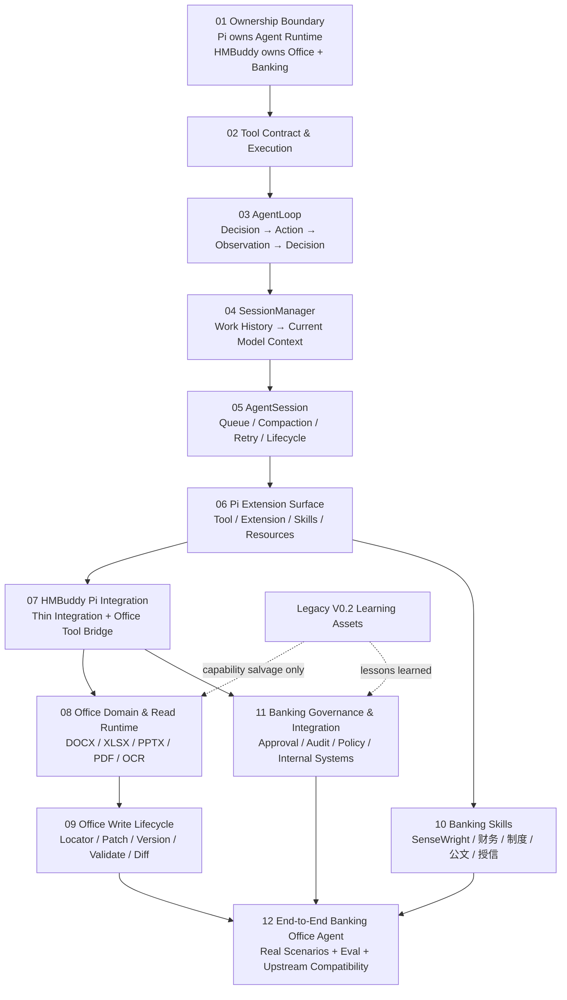

# HMBuddy 概念地图 V1.0

> **Canonical Architecture:** `requirements/hmbuddy-architecture-baseline.md V1.0 — Pi-native Banking Office Agent`  
> **Learning Quality Baseline:** `00-quality-baseline-pi-agentsession-tool-calling/`  
> **Current VNext Spike:** `requirements/vnext-01-pi-native-bootstrap-integration-spike-v0.1.md`  
> **Map baseline:** HMBuddy `main@84afe54b2994988e7e7f4e9a661142ece9cb50c7`

这张地图取代 V0.2 的“**HMBuddy 自建 Minimal Agent Kernel**”学习主线。

V1.0 的认知起点已经改变：

> **不再问“HMBuddy 应该怎样实现 Agent 基础设施”，而先问“Pi 已经拥有什么、HMBuddy 真正应该拥有什么，以及二者通过什么公开 seam 连接”。**

因此，本图不按旧 Phase 编号、旧目录顺序或代码模块数量组织，而按：

1. **Ownership Boundary**；
2. **认知依赖**；
3. **控制权流动**；
4. **领域差异化价值**；

组织。

---

# 1. 一张图看懂 V1.0



顶层只有两类 Ownership：

```text
Pi-owned
────────────────────────
Agent lifecycle
Tool execution
AgentLoop
Session / SessionManager
Context reconstruction
Compaction
Model runtime
Extension / Skills / Resources
MCP / Codemode / Events
SDK / RPC

HMBuddy-owned
────────────────────────
Office Artifact domain
Office read / write capabilities
DOCX / XLSX / PPTX / PDF / OCR
WPS / Office COM
Artifact Locator / Patch / Version / Diff
Banking Skills
Approval / Audit / Sensitive-data policy
Bank internal integrations
Bank-specific product UX
Office / Banking eval corpus
```

**两边的连接必须薄：**

```text
Pi
 ↓
HMBuddy Pi Integration
 ↓
Office Tool Bridge
 ↓
Python Office Runtime / Bank Integrations
```

---

# 2. 为什么旧 Concept Map 不能继续作为主干

V0.2 的主线隐含：

```text
HMBuddy
  ↓
未来自行实现
Session
AgentLoop
ToolRegistry
ExtensionHost
```

V1.0 已经明确改成：

```text
Pi
├─ Session
├─ AgentLoop
├─ Tool runtime
├─ Extension
├─ Skills
└─ Context / Compaction

HMBuddy
├─ Pi Integration
├─ Office Runtime
├─ Banking Skills
└─ Banking Governance
```

因此以下旧学习主题的**知识仍可能有价值，但所有权已改变**：

| 旧主题 | V1.0 新定位 |
|---|---|
| Session / SessionStore | 学 Pi SessionManager / AgentSession，不再设计 HMBuddy Session Framework |
| AgentLoop | 学 Pi 的真实 loop，不再实现 HMBuddy AgentLoop |
| Tool / ToolRegistry | 学 Pi Tool Contract / execution，不再建平行 ToolRegistry |
| ExtensionHost | 学 Pi Extension API，不再建 HMBuddy ExtensionHost |
| Context + LLM | 学 Pi Model / Context / Compaction；旧 LLM client 仅为历史实现 |
| Plugin Runtime | Legacy lesson；通用扩展由 Pi Extension/Resources 承担 |
| AppConfig / AppState | Legacy product implementation；VNext 只保留 HMBuddy-owned 配置 |
| Desktop Shell | Legacy UI；是否建设 dedicated UI 由真实场景以后决定 |
| Artifact | 从“Agent Kernel primitive”降回 **Office Domain Model**，反而成为 HMBuddy 核心资产 |
| Artifact Patch / Diff | 从未来附属能力提升为 HMBuddy 领域主线 |

---

# 3. 四条学习主干

## A. Pi Agent Runtime：Agent 为什么能持续做事

这一条先回答：

> **控制权怎样从宿主程序转移给模型，同时仍保持程序可控？**

学习顺序：

```text
02 Tool
   ↓
03 AgentLoop
   ↓
04 SessionManager
   ↓
05 AgentSession
```

不要一上来同时学习 Session、Extension、MCP、Memory、Multi-Agent。

---

## B. Pi Extension & HMBuddy Integration：产品怎样进入 Pi

这一条回答：

> **既然 HMBuddy 不拥有 Agent Runtime，它怎样加入自己的领域行为？**

学习顺序：

```text
06 Pi Extension Surface
   ↓
07 HMBuddy Pi Integration
   ↓
Office Tool Bridge
```

核心原则：

> **使用公开 seam，不复制 Pi runtime。**

---

## C. Office Domain：HMBuddy 真正应该投入工程资源的地方

这一条回答：

> **Office 文件为什么不能退化成普通文本，以及可靠读写到底需要哪些领域模型？**

学习顺序：

```text
08 Office Read / Artifact Domain
   ↓
09 Write Lifecycle
```

这是 HMBuddy 与普通 Pi distribution 拉开差异的主战场。

---

## D. Banking Product：为什么它不是一个普通 Office Agent

这一条回答：

> **银行场景额外需要哪些工作方法、治理和内部系统能力？**

学习顺序：

```text
10 Banking Skills
11 Banking Governance & Integration
        ↓
12 End-to-End Banking Office Agent
```

---

# 4. 一级学习节点

## 01 — Ownership Boundary：谁拥有哪一层

### 核心问题

> 为什么 HMBuddy V1.0 不再自行实现 Minimal Agent Kernel？

### 必须建立的概念

```text
Upstream First
No Fork by Default
Thin Integration
Domain over Framework
Migration by Capability
Pi-owned
HMBuddy-owned
Do Not Own
```

### 学完后必须能判断

遇到一个新需求时，先分类：

```text
Generic Agent capability?
    → 先找 Pi

Agent executable behavior?
    → Pi Tool / Extension

Instruction / work method?
    → Skill

Office operation?
    → HMBuddy Office Runtime

Bank-specific governance/integration?
    → HMBuddy
```

### 当前权威资料

- [Canonical Architecture V1.0](../../requirements/hmbuddy-architecture-baseline.md)
- [VNext-01 Pi-native Bootstrap & Office Integration Spike](../../requirements/vnext-01-pi-native-bootstrap-integration-spike-v0.1.md)

### 为什么它必须排第一

Ownership 没搞清楚，后面越学 Pi，越容易再次把 Pi 的能力“理解成 HMBuddy 应该自己实现的模块”。

---

## 02 — Tool Contract & Tool Execution：模型怎样表达一个动作

### 核心问题

> 模型输出一个 Tool Call，为什么还不等于函数已经执行？

### 认知链

```text
Tool declaration
  ↓
Action Space
  ↓
Tool Call
  ↓
lookup
  ↓
prepare / validate arguments
  ↓
policy / beforeToolCall
  ↓
execute
  ↓
Tool Result
```

### Canonical Terms

| Term | 固定含义 |
|---|---|
| Tool declaration | 模型可见的 Action Contract |
| Tool implementation | 程序真正执行动作的代码 |
| Tool Call | 模型产生的结构化 Action Intent |
| Tool Result | 一次执行的标准程序结果 |

### 关键边界

```text
参数结构合法
≠
动作被授权

Tool Call
≠
Tool execution

Tool Result
≠
Final Answer
```

### 当前学习单元

[Pi AgentSession / Tool Calling Quality Baseline](./00-quality-baseline-pi-agentsession-tool-calling/)

重点先读：

- [D — Deep Read](./00-quality-baseline-pi-agentsession-tool-calling/D-deep-read.md) 第 0–3 章。

---

## 03 — AgentLoop：Observation 怎样重新进入 Decision

### 核心问题

> Tool 已经执行完，为什么 Agent 还需要 Loop？

### 最小闭环

```text
Decision
   ↓
Action / Tool Call
   ↓
Tool execution
   ↓
Tool Result
   ↓
Observation
   ↓
Decision again
```

### 必须理解

> **Observation** 不是另一个程序对象；它是从 Agent 决策角度理解 Tool Result 所带来的新信息。

AgentLoop 的核心职责不是“多跑几次模型”，而是：

> **让 Action 产生的新事实重新影响下一次 Decision。**

### 到这里仍不要引入

```text
Planner
Workflow DAG
TaskEngine
Multi-Agent
```

这些不是 AgentLoop 成立的必要条件。

### 当前学习单元

[D — Deep Read](./00-quality-baseline-pi-agentsession-tool-calling/D-deep-read.md) 第 3–4 章。

---

## 04 — SessionManager：长期工作怎样重建当前上下文

### 核心问题

> 一次 Agent run 结束以后，下一次“继续刚才的工作”到底从哪里恢复？

### 必须区分的四个概念

```text
Work History
≠
Session Tree
≠
Current Branch
≠
Current Model Context
```

### 投影链

```text
Work History
    ↓
Session Tree
    ↓
Current Branch
    ↓
Session Projection
    ↓
Current Model Context
```

### Canonical Terms

| Term | 含义 |
|---|---|
| Work History | 一段工作完整、可追溯的历史 |
| Session Tree | Pi 以 append-only entries + parentId 表示历史分支的结构 |
| Current Branch | 当前 leaf 对应的一条工作路径 |
| Current Model Context | 当前一次模型请求真正看到的内容 |
| SessionManager | 从完整历史重建当前工作状态与模型上下文的 authority |

### 关键认知

`SessionManager.inMemory()`：

```text
改变 persistence
不改变 Session authority
```

### 当前学习单元

[D — Deep Read](./00-quality-baseline-pi-agentsession-tool-calling/D-deep-read.md) 第 5–6 章。

---

## 05 — AgentSession：一次次 Agent run 怎样变成长程工作

### 核心问题

> SessionManager 管历史，那么谁管理“工作正在进行时”的时序、恢复和 lifecycle？

### 主要机制

```text
AgentSession
├─ prompt / run orchestration
├─ steer
├─ followUp
├─ queue_update
├─ compaction
├─ retry / recovery
├─ agent events
└─ extension lifecycle
```

### 三个关键问题

#### 输入何时生效

```text
steer
→ 当前工作方向修正
→ 下一合适 decision boundary 生效

followUp
→ 当前工作完成以后
→ 再处理下一项
```

#### 历史太长怎么办

```text
Work History 持续增长
≠
Current Model Context 无限增长

Compaction
→ 不删除完整工作事实
→ 改变历史投影到当前 Context 的方式
```

#### Provider 临时失败怎么办

Retry / Recovery 属于 session-level concern，不应和 Office parser retry 混在一起。

### 当前学习单元

[D — Deep Read](./00-quality-baseline-pi-agentsession-tool-calling/D-deep-read.md) 第 7–9、12 章。

---

## 06 — Pi Extension Surface：产品如何扩展 Pi，而不是重写 Pi

### 核心问题

> HMBuddy 怎样加入自己的行为，同时不重新拥有 Agent Runtime？

### 主要公开 seam

```text
Pi Extension
├─ registerTool()
├─ tool lifecycle
├─ agent/session events
├─ resources
├─ skills
└─ other upstream public contracts
```

### 必须区分

```text
registered
≠
active
≠
callable
```

“代码里注册了 Tool”不等于“当前模型的 Action Space 里一定有这个 Tool”。

### HMBuddy 的原则

```text
Agent behavior
→ Pi Extension / Tool

Instruction
→ Skill

不要：
→ HMBuddy ExtensionHost
→ HMBuddy ToolRegistry
```

### 当前学习单元

[D — Deep Read](./00-quality-baseline-pi-agentsession-tool-calling/D-deep-read.md) 第 10–12 章。

---

## 07 — HMBuddy Pi Integration：Pi 与 Office Domain 的薄边界

### 核心问题

> Pi Tool 怎样可靠调用与 Pi 解耦的 Python Office 能力？

### 当前 VNext-01 验收链

```text
User Prompt
   ↓
Pi AgentSession
   ↓
HMBuddy Pi Extension
   ↓
read_office_file
   ↓
TypeScript Office Bridge
   ↓
Python subprocess
   ↓
DOCX structured result
   ↓
Pi Tool Result / Observation
   ↓
Assistant final answer
```

### Runtime split

```text
TypeScript Host
→ Pi-native orchestration / extension / tool integration

Python Office Runtime
→ Office parsing / editing / validation / COM / OCR
```

### 边界原则

Python Office Runtime 不理解：

```text
Session
AgentLoop
Prompt
Model
Memory
Planner
```

Pi integration layer 不应该自己：

```text
parse DOCX
maintain history
decide tool sequence
implement AgentLoop
```

### 当前规格

[VNext-01 — Pi-native Bootstrap & Office Integration Spike](../../requirements/vnext-01-pi-native-bootstrap-integration-spike-v0.1.md)

这是 V1.0 架构的第一条真实代码验收线。

---

## 08 — Office Domain & Read Runtime：HMBuddy 真正拥有的“眼睛”

### 核心问题

> Office 文件为什么不能被简单当作一串 Markdown / plain text？

### HMBuddy-owned Domain

```text
DOCX
XLSX
PPTX
PDF
OCR
WPS / Office COM
tables
slides
cells
paragraphs
layout / locator facts
```

### Office Domain Model 的方向

```text
Artifact
ArtifactBlock
ArtifactLocator
```

但 V1.0 有一个重要约束：

> **不因为 Legacy 已经有 Artifact Contract，就直接复制旧 Contract。**

VNext-01 先使用最小 `OfficeReadResult`。

只有多个真实 Office 场景共同证明需要时，再冻结 VNext Artifact Contract。

### Legacy 中可优先重新证明的能力

- [Artifact / IR 旧学习单元](./03-artifact-ir/)
- [Adapter / Parsing 旧学习单元](./04-adapter-parsing/)
- PDF table reconstruction
- OCR pipeline
- DOCX parsing details
- XLSX structure handling
- Office / WPS COM
- Office fixtures / eval corpus

### 学习方式

这里不是“旧代码照搬”，而是：

```text
真实 Office failure mode
  ↓
查看 Legacy 是否已经解决
  ↓
提取算法 /测试 /领域经验
  ↓
重新进入 VNext Contract
```

---

## 09 — Office Write Lifecycle：从“读懂文件”到“持续维护成果”

### 核心问题

> 一个 Office Agent 的真正差异，为什么最终一定落到可靠修改同一成果？

### 目标链

```text
Artifact
   ↓
Locator
   ↓
Patch
   ↓
New Version
   ↓
Validate
   ↓
Diff
```

### 推荐领域对象

```text
Artifact
ArtifactBlock
ArtifactLocator
ArtifactPatch
ArtifactVersion
ArtifactDiff
ValidationResult
```

### 设计原则

1. 不过早设计万能 Patch DSL；
2. Locator 必须被真实编辑需求证明；
3. Validation 不是“文件能打开”这么简单；
4. Diff 要服务用户确认、审计和 Agent 自检；
5. 原生 Office 结构优先于把文档拍平成 Markdown 后重写。

### Legacy 学习资产

[Artifact Write Lifecycle 旧学习单元](./22-artifact-write-lifecycle/)

它现在应被视为：

> **领域设计素材，而不是 V0.2 Canonical Future Kernel 的延续。**

---

## 10 — Banking Skills：把“怎么做银行工作”交给可组合的方法层

### 核心问题

> Agent 有 Tool 以后，怎样知道一类银行工作应该按什么方法完成？

### 责任边界

```text
Skill
→ 应该怎样完成一类工作

Tool
→ 能执行什么动作

Office Runtime
→ 动作怎样可靠落到文件

Pi
→ 怎样组织 Agent 工作
```

### 优先 Skills

```text
SenseWright
├─ Deep Read
├─ Review
├─ Learning
└─ Practice

Financial Analysis
Regulation Review
Document Drafting
Credit / Risk Analysis
```

### V1.0 原则

HMBuddy **不实现自己的 Skill Runtime**。

优先采用 Pi / Agent Skills 兼容形式。

SenseWright 的学习价值也因此发生变化：

> 它不只是 HMBuddy 内部学习方法，还可以成为未来 Banking / Knowledge Work Skill 的设计实验场。

---

## 11 — Banking Governance & Internal Integration：为什么普通 Pi 还不够

### 核心问题

> Pi 能做 Agent，但银行内网为什么仍需要 HMBuddy 自己补一层治理？

### Banking Governance

```text
Approval
Audit
Path policy
Network policy
Sensitive-data policy
Internal endpoint allowlist
Process / COM control
Artifact version / diff evidence
```

### 最低动作语义

对高风险动作至少具备：

```text
ALLOW
ASK
DENY
```

但优先通过 Pi 的 Tool lifecycle / Extension seam 实现，不建设第二套 Tool Runtime。

### Internal Integration

```text
Internal Model
OA
WPS / Office
Bank Internal API
Knowledge Systems
Business Systems
MCP / approved connectors
```

### 安全认知

```text
cwd / project trust
≠
完整安全边界
```

真正的隔离仍需结合：

- OS account；
- filesystem ACL；
- sandbox / process isolation；
- network control；
- extension policy。

### Legacy 中可吸收的经验

- [Runtime Governance 旧学习单元](./07-runtime-governance/)
- Workspace boundary / path trust 经验
- Plugin permission / availability 失败模式
- 企业内网 Desktop / config 中积累的治理需求

但不要迁移旧通用 Runtime 本身。

---

## 12 — End-to-End Banking Office Agent：所有概念最终必须在真实工作里闭环

### 核心问题

> 前面的概念如果不能共同完成真实银行办公任务，学习和架构是否真的成立？

### 目标闭环

```text
User Goal
   ↓
Pi AgentSession
   ↓
Pi decides Tool
   ↓
HMBuddy Office / Bank Tool
   ↓
Office Runtime / Internal System
   ↓
Observation
   ↓
Pi continues
   ↓
Bank Skill guides work
   ↓
Create / Patch Artifact
   ↓
Validate / Diff
   ↓
Approval / Audit
   ↓
Final Result
```

### 第一条验收线

VNext-01：

```text
Pi
→ read_office_file
→ Python DOCX reader
→ structured Tool Result
→ Pi final answer
```

成功只证明：

> **新的 Ownership Boundary 可以工作。**

它不证明 Office Agent 已经完整。

### 后续演进方向

```text
VNext-01  Pi-native integration spike
    ↓
Office Read Pack
    ↓
Office Write Lifecycle
    ↓
Banking Skills
    ↓
Banking Governance
    ↓
Dedicated Product UI（只有真实需要时）
```

### Eval 原则

每一阶段都必须区分：

```text
Protocol success
Tool success
Agent success
Domain correctness
Product usefulness
```

例如：

> parser 成功 ≠ Agent 最终事实正确。

---

# 5. 推荐学习顺序

## 主线学习

不要再按旧目录 `01 → 23` 顺序机械学习。

推荐：

```text
01 Ownership
↓
02 Tool
↓
03 AgentLoop
↓
04 SessionManager
↓
05 AgentSession
↓
06 Extension
↓
07 HMBuddy Pi Integration
↓
08 Office Domain
↓
09 Write Lifecycle
↓
10 Banking Skills
↓
11 Governance
↓
12 End-to-End Capstone
```

每一节点只有在回答清楚“**为什么下一个概念现在才需要出现**”以后，再进入下一节点。

---

## 当前最优先路线

如果目标是直接支撑当前 VNext-01 开发：

```text
01
→ 02
→ 03
→ 04
→ 05
→ 06
→ 07
```

其中 **02–06 不建议立即拆成五套独立 D/R/L/P**。

当前：

[00-quality-baseline-pi-agentsession-tool-calling](./00-quality-baseline-pi-agentsession-tool-calling/)

已经作为一条完整纵向学习样本覆盖：

```text
Tool
→ AgentLoop
→ SessionManager
→ AgentSession
→ Extension
→ HMBuddy mapping
```

先把这条链真正学通，再判断哪些节点需要独立扩展。

---

# 6. 当前学习资产如何重新分类

现有 V0.2 时代的学习目录不删除。

它们进入：

> **Legacy Learning Assets**

用途变成三类：

1. **领域能力素材**；
2. **失败模式 / 测试素材**；
3. **为什么 V1.0 重构的历史证据**。

---

## A. 仍高度相关，可按能力吸收

| Legacy 学习资产 | V1.0 用途 |
|---|---|
| [03 Artifact](./03-artifact-ir/) | Office Domain / Locator / future Artifact VNext 素材 |
| [04 Adapter / Parsing](./04-adapter-parsing/) | DOCX/PDF/XLSX/PPTX/OCR 算法素材 |
| [07 Runtime Governance](./07-runtime-governance/) | 银行治理 failure mode 素材 |
| [09 Eval / Feedback](./09-eval-feedback/) | Office / Banking eval 方法素材 |
| [22 Artifact Write Lifecycle](./22-artifact-write-lifecycle/) | Patch / Version / Diff 领域设计素材 |
| [23 Office Agent Capstone](./23-office-agent-capstone/) | 真实场景验收素材，需要按 Pi-native 路线重写 |

---

## B. 概念要学，但不再作为 HMBuddy-owned 实现

| Legacy 学习资产 | V1.0 处理 |
|---|---|
| [08 Context + LLM](./08-context-llm/) | 转向学习 Pi Model / Context / Compaction |
| [16 Conversation vs Session](./16-conversation-vs-session/) | 保留 Product Surface vs Runtime 的认知边界 |
| [17 Session Store](./17-session-store/) | 不再设计 HMBuddy Session；改学 Pi SessionManager |
| [18 Agent Loop](./18-agent-loop/) | 不再实现；改学 Pi AgentLoop |
| [19 Tool Registry](./19-tool-registry/) | 不再建 Registry；改学 Pi Tool Contract / execution |
| [20 Skill](./20-skill-progressive-disclosure/) | 转为 Pi / Agent Skills 兼容学习 |
| [21 ExtensionHost](./21-extension-host/) | 不再建 Host；改学 Pi Extension API |

---

## C. 降级为历史实现 / Lessons Learned

| Legacy 学习资产 | 现在的定位 |
|---|---|
| [02 Workspace](./02-workspace/) | 旧 Workspace abstraction 不默认迁移；保留 path/trust lessons |
| [05 Capability Facade](./05-capability-facade/) | 旧 Runtime abstraction 参考，不是 VNext 主干 |
| [06 File Capability Runtime](./06-file-capability-runtime/) | Generic Plugin Runtime 不迁移 |
| [10 AppConfig](./10-app-config/) | Legacy desktop/config 经验 |
| [11 AppState / Recent](./11-app-state-recent/) | Legacy product state 经验 |
| [12 App Runtime Composition](./12-app-runtime-composition/) | Legacy Composition Root 经验 |
| [13 Plugin Product View](./13-plugin-product-view/) | Legacy product explainability 经验 |
| [14 Desktop Shell](./14-conversation-first-shell/) | Legacy UI，不构成 VNext 兼容要求 |
| [15 Preview](./15-preview-representation/) | Preview 表示经验，可在未来 Product UI 重用 |

旧目录继续留在 Git 中，但：

> **不再用它们的编号定义新的认知顺序。**

---

# 7. 暂时不要新建的学习主题

为了防止地图重新膨胀，当前不要因为名词出现就立刻建立独立 D/R/L/P：

```text
MCP
Codemode
Memory
Planner
Multi-Agent
Workflow DAG
TaskEngine
Dedicated GUI
Long-lived Python daemon
Generic RAG
```

只有当当前真实场景提出问题，而且它不能被已有节点解释时，才把新概念提升为一级节点。

---

# 8. Concept Promotion Rule

一个概念要升级成新的一级学习节点，至少满足三项：

1. **它解决了一个当前地图无法解释的新问题；**
2. **它改变了关键控制权、状态或 Ownership Boundary；**
3. **它会持续影响后续多个工程决策。**

如果只是：

- 一个 API；
- 一个类；
- 一个实现函数；
- 某个格式细节；
- 一次性兼容问题；

则留在现有学习节点内部。

> **概念地图不是源码目录树，也不是功能清单。**

---

# 9. D → R → L → P 如何与新地图配合

V1.0 不要求“12 个节点 = 12 套 D/R/L/P”。

正确关系是：

```text
Concept Map
→ 决定认知主线

真实学习问题
→ 选择一个或多个相邻概念

D / R / L / P
→ 围绕这条连续问题链形成学习单元
```

例如当前 Quality Baseline：

```text
Tool
→ AgentLoop
→ SessionManager
→ AgentSession
→ Extension
```

跨越 02–06 五个概念，但它们共同回答一个连续问题：

> “一个模型怎样从会回答，演化成能通过 Tool 持续完成长期工作，并给 HMBuddy 留出产品扩展面？”

这种学习单元是允许的，而且比硬拆五份更符合 Cognitive Continuity。

---

# 10. 当前学习重点

现在最重要的不是把所有 Legacy 目录重写一遍。

而是先完成三件事：

### 1. 把 Pi Runtime mental model 学稳

必须能连续解释：

```text
Tool Call
→ execution
→ Tool Result
→ Observation
→ AgentLoop
→ Work History
→ SessionManager
→ AgentSession
→ Extension
```

当前权威学习单元：

[00-quality-baseline-pi-agentsession-tool-calling](./00-quality-baseline-pi-agentsession-tool-calling/)

---

### 2. 用 VNext-01 证明 Ownership Boundary

必须真实跑通：

```text
Pi Agent
→ HMBuddy Tool
→ Python Office Runtime
→ Pi Observation
→ final answer
```

如果这条链失败，应优先重新检查架构假设，而不是继续扩功能。

---

### 3. 开始把注意力转移到 Office Domain

一旦 VNext-01 成立，学习投入应逐步从：

```text
“Agent Framework 怎么造”
```

转成：

```text
“Office capability 怎么做得可靠”
+
“银行工作方法怎样进入 Skills”
+
“银行治理怎样落到 Pi seam”
```

这才是 HMBuddy V1.0 的长期差异化方向。

---

# 11. 最终 Mental Model

以后看到 HMBuddy，应先想到：

```text
Pi owns the Agent
        │
        ▼
HMBuddy extends Pi
        │
        ▼
Office Tools / Banking Skills / Governance
        │
        ▼
Python Office Runtime / Bank Systems
```

而不是：

```text
HMBuddy
├─ AgentLoop
├─ SessionStore
├─ ToolRegistry
├─ ExtensionHost
├─ Model Runtime
└─ Plugin Framework
```

最终一句话：

> **HMBuddy 不再“像 Pi 一样实现一个 Agent”；HMBuddy 是建立在 Pi 上、拥有 Office 与 Banking Domain 的 Agent 产品。**
