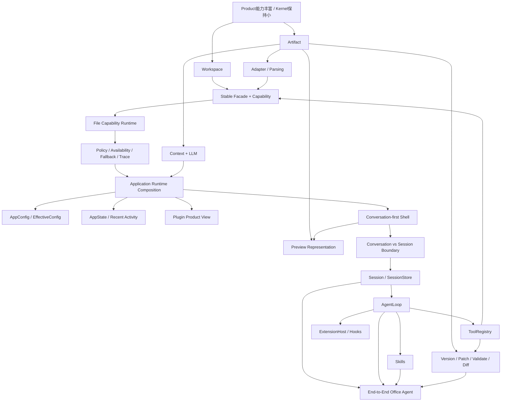

# HMBuddy 概念地图 V0.2

> Source baseline: `14b79558cf25bba31a971fe144d83c145d9e7b46`  
> Canonical Architecture: `requirements/hmbuddy-architecture-baseline.md V0.2`

这张图不按 Phase 编号组织，而按**认知依赖与控制权层级**组织。

## 分层

### A. 架构元模型
- 01 架构总纲：WorkBuddy-like Product on a Pi-like Minimal Harness — Canonical Architecture V0.2；当前有效

### B. 当前 Office / File Runtime
- 02 Workspace：工作域、文件发现与信任边界 — 已实现并在 Phase 2.1.1 与 AppRuntime Catalog 对齐
- 03 Artifact：Office 领域中间表示与稳定定位 — 已实现 ArtifactRef/Artifact/ArtifactBlock/ArtifactLocator；Version/Patch 未来
- 04 Adapter / Parsing Boundary：Native Structure、OCR 与 COM — 已实现多格式读取与 OCR/COM fallback
- 05 Stable Facade + Capability：应用意图与 Runtime 能力 — artifact.read.full 已实现；其他能力为目标命名空间
- 06 File Capability Runtime：Manifest、Plugin、Provider、Registry、Router — 已实现并硬化
- 07 Runtime Governance：Policy、Availability、Fallback、Trace — 已实现
- 08 Context + LLM Interface：模型实际看到什么 — 已实现并在 Phase 2.1.1 修复真实 OpenAI Client 初始化
- 09 Eval / Feedback Loop：从失败模式到可回归证据 — 已实现多层 Eval、Phase baseline 与跨平台 CI

### C. 当前 Application / Product Layer
- 10 AppConfig / EffectiveConfig：配置、来源优先级与本地数据目录 — Phase 2.1 已实现，2.1.1 已加固 False/0 与显式 env
- 11 AppState / Recent Workspace / Recent Activity：轻量恢复而非 Task 域 — Phase 2.1 已实现，2.1.1 统一 Workspace ID 与隐私语义
- 12 Application Runtime Composition：Controller 与单一运行时事实 — Phase 2.1/2.1.1 已实现
- 13 Plugin Manager / System Status：把 Runtime 事实翻译成产品可解释性 — Phase 2.1 已实现，2.1.1/2.2 加固产品视图
- 14 Conversation-first Desktop Shell：Product Layer 与 Human-in-the-loop — Phase 2.2 已实现（PySide6）
- 15 Artifact Preview：可读取、可表示、可预览是三件不同的事 — Phase 2.2 已实现 Markdown/TXT Preview
- 16 Conversation Surface vs Session Domain：UI 语言与 Kernel 原语 — Conversation 已实现；Session 明确未实现

### D. Canonical Minimal Agent Kernel（未来）
- 17 Session / SessionStore：持久工作上下文、Product Task 与 Resume — Canonical future Kernel primitive；Stage B 未实现
- 18 AgentLoop：最小自主决策闭环 — Canonical future Kernel primitive；未实现
- 19 Tool / ToolRegistry：模型动作接口与 Capability 的桥 — Canonical future Kernel primitive；未实现
- 20 Skill：Markdown-first 工作方法与 Progressive Disclosure — Canonical future capability；SenseWright 被指定为优先接入 Skills
- 21 ExtensionHost / Hooks / Events：高级 Agent 能力的统一扩展面 — Canonical future Kernel primitive；未实现

### E. Office Agent 关键跃迁与总闭环
- 22 Artifact Write Lifecycle：Version、Patch、Validate、Diff — Canonical future Office capability；尚未实现
- 23 End-to-End Office Agent：从工作区到持续可修改成果 — 目标闭环；Stage B–D 尚未完成

## 全量学习索引

|#|概念|当前状态|D → R → L → P|
|---:|---|---|---|
|1|[架构总纲：WorkBuddy-like Product on a Pi-like Minimal Harness](./01-architecture-baseline/)|Canonical Architecture V0.2；当前有效|[D](./01-architecture-baseline/D-deep-read.md) · [R](./01-architecture-baseline/R-review.md) · [L](./01-architecture-baseline/L-learning.md) · [P](./01-architecture-baseline/P-practice.md)|
|2|[Workspace：工作域、文件发现与信任边界](./02-workspace/)|已实现并在 Phase 2.1.1 与 AppRuntime Catalog 对齐|[D](./02-workspace/D-deep-read.md) · [R](./02-workspace/R-review.md) · [L](./02-workspace/L-learning.md) · [P](./02-workspace/P-practice.md)|
|3|[Artifact：Office 领域中间表示与稳定定位](./03-artifact-ir/)|已实现 ArtifactRef/Artifact/ArtifactBlock/ArtifactLocator；Version/Patch 未来|[D](./03-artifact-ir/D-deep-read.md) · [R](./03-artifact-ir/R-review.md) · [L](./03-artifact-ir/L-learning.md) · [P](./03-artifact-ir/P-practice.md)|
|4|[Adapter / Parsing Boundary：Native Structure、OCR 与 COM](./04-adapter-parsing/)|已实现多格式读取与 OCR/COM fallback|[D](./04-adapter-parsing/D-deep-read.md) · [R](./04-adapter-parsing/R-review.md) · [L](./04-adapter-parsing/L-learning.md) · [P](./04-adapter-parsing/P-practice.md)|
|5|[Stable Facade + Capability：应用意图与 Runtime 能力](./05-capability-facade/)|artifact.read.full 已实现；其他能力为目标命名空间|[D](./05-capability-facade/D-deep-read.md) · [R](./05-capability-facade/R-review.md) · [L](./05-capability-facade/L-learning.md) · [P](./05-capability-facade/P-practice.md)|
|6|[File Capability Runtime：Manifest、Plugin、Provider、Registry、Router](./06-file-capability-runtime/)|已实现并硬化|[D](./06-file-capability-runtime/D-deep-read.md) · [R](./06-file-capability-runtime/R-review.md) · [L](./06-file-capability-runtime/L-learning.md) · [P](./06-file-capability-runtime/P-practice.md)|
|7|[Runtime Governance：Policy、Availability、Fallback、Trace](./07-runtime-governance/)|已实现|[D](./07-runtime-governance/D-deep-read.md) · [R](./07-runtime-governance/R-review.md) · [L](./07-runtime-governance/L-learning.md) · [P](./07-runtime-governance/P-practice.md)|
|8|[Context + LLM Interface：模型实际看到什么](./08-context-llm/)|已实现并在 Phase 2.1.1 修复真实 OpenAI Client 初始化|[D](./08-context-llm/D-deep-read.md) · [R](./08-context-llm/R-review.md) · [L](./08-context-llm/L-learning.md) · [P](./08-context-llm/P-practice.md)|
|9|[Eval / Feedback Loop：从失败模式到可回归证据](./09-eval-feedback/)|已实现多层 Eval、Phase baseline 与跨平台 CI|[D](./09-eval-feedback/D-deep-read.md) · [R](./09-eval-feedback/R-review.md) · [L](./09-eval-feedback/L-learning.md) · [P](./09-eval-feedback/P-practice.md)|
|10|[AppConfig / EffectiveConfig：配置、来源优先级与本地数据目录](./10-app-config/)|Phase 2.1 已实现，2.1.1 已加固 False/0 与显式 env|[D](./10-app-config/D-deep-read.md) · [R](./10-app-config/R-review.md) · [L](./10-app-config/L-learning.md) · [P](./10-app-config/P-practice.md)|
|11|[AppState / Recent Workspace / Recent Activity：轻量恢复而非 Task 域](./11-app-state-recent/)|Phase 2.1 已实现，2.1.1 统一 Workspace ID 与隐私语义|[D](./11-app-state-recent/D-deep-read.md) · [R](./11-app-state-recent/R-review.md) · [L](./11-app-state-recent/L-learning.md) · [P](./11-app-state-recent/P-practice.md)|
|12|[Application Runtime Composition：Controller 与单一运行时事实](./12-app-runtime-composition/)|Phase 2.1/2.1.1 已实现|[D](./12-app-runtime-composition/D-deep-read.md) · [R](./12-app-runtime-composition/R-review.md) · [L](./12-app-runtime-composition/L-learning.md) · [P](./12-app-runtime-composition/P-practice.md)|
|13|[Plugin Manager / System Status：把 Runtime 事实翻译成产品可解释性](./13-plugin-product-view/)|Phase 2.1 已实现，2.1.1/2.2 加固产品视图|[D](./13-plugin-product-view/D-deep-read.md) · [R](./13-plugin-product-view/R-review.md) · [L](./13-plugin-product-view/L-learning.md) · [P](./13-plugin-product-view/P-practice.md)|
|14|[Conversation-first Desktop Shell：Product Layer 与 Human-in-the-loop](./14-conversation-first-shell/)|Phase 2.2 已实现（PySide6）|[D](./14-conversation-first-shell/D-deep-read.md) · [R](./14-conversation-first-shell/R-review.md) · [L](./14-conversation-first-shell/L-learning.md) · [P](./14-conversation-first-shell/P-practice.md)|
|15|[Artifact Preview：可读取、可表示、可预览是三件不同的事](./15-preview-representation/)|Phase 2.2 已实现 Markdown/TXT Preview|[D](./15-preview-representation/D-deep-read.md) · [R](./15-preview-representation/R-review.md) · [L](./15-preview-representation/L-learning.md) · [P](./15-preview-representation/P-practice.md)|
|16|[Conversation Surface vs Session Domain：UI 语言与 Kernel 原语](./16-conversation-vs-session/)|Conversation 已实现；Session 明确未实现|[D](./16-conversation-vs-session/D-deep-read.md) · [R](./16-conversation-vs-session/R-review.md) · [L](./16-conversation-vs-session/L-learning.md) · [P](./16-conversation-vs-session/P-practice.md)|
|17|[Session / SessionStore：持久工作上下文、Product Task 与 Resume](./17-session-store/)|Canonical future Kernel primitive；Stage B 未实现|[D](./17-session-store/D-deep-read.md) · [R](./17-session-store/R-review.md) · [L](./17-session-store/L-learning.md) · [P](./17-session-store/P-practice.md)|
|18|[AgentLoop：最小自主决策闭环](./18-agent-loop/)|Canonical future Kernel primitive；未实现|[D](./18-agent-loop/D-deep-read.md) · [R](./18-agent-loop/R-review.md) · [L](./18-agent-loop/L-learning.md) · [P](./18-agent-loop/P-practice.md)|
|19|[Tool / ToolRegistry：模型动作接口与 Capability 的桥](./19-tool-registry/)|Canonical future Kernel primitive；未实现|[D](./19-tool-registry/D-deep-read.md) · [R](./19-tool-registry/R-review.md) · [L](./19-tool-registry/L-learning.md) · [P](./19-tool-registry/P-practice.md)|
|20|[Skill：Markdown-first 工作方法与 Progressive Disclosure](./20-skill-progressive-disclosure/)|Canonical future capability；SenseWright 被指定为优先接入 Skills|[D](./20-skill-progressive-disclosure/D-deep-read.md) · [R](./20-skill-progressive-disclosure/R-review.md) · [L](./20-skill-progressive-disclosure/L-learning.md) · [P](./20-skill-progressive-disclosure/P-practice.md)|
|21|[ExtensionHost / Hooks / Events：高级 Agent 能力的统一扩展面](./21-extension-host/)|Canonical future Kernel primitive；未实现|[D](./21-extension-host/D-deep-read.md) · [R](./21-extension-host/R-review.md) · [L](./21-extension-host/L-learning.md) · [P](./21-extension-host/P-practice.md)|
|22|[Artifact Write Lifecycle：Version、Patch、Validate、Diff](./22-artifact-write-lifecycle/)|Canonical future Office capability；尚未实现|[D](./22-artifact-write-lifecycle/D-deep-read.md) · [R](./22-artifact-write-lifecycle/R-review.md) · [L](./22-artifact-write-lifecycle/L-learning.md) · [P](./22-artifact-write-lifecycle/P-practice.md)|
|23|[End-to-End Office Agent：从工作区到持续可修改成果](./23-office-agent-capstone/)|目标闭环；Stage B–D 尚未完成|[D](./23-office-agent-capstone/D-deep-read.md) · [R](./23-office-agent-capstone/R-review.md) · [L](./23-office-agent-capstone/L-learning.md) · [P](./23-office-agent-capstone/P-practice.md)|

## 当前项目最关键的三个认知变化

1. **Phase 2.1 已从“未来规格”变成真实 Application Layer。** Config、State、Recent、Plugin Product View、Controller 都必须按当前代码学习。
2. **Phase 2.2 的 Conversation 是 Product Surface，不是 Session。** UI 已像 Agent，但 Kernel 仍没有 Session/AgentLoop/ToolRegistry/ExtensionHost。
3. **未来“任务/恢复”的主轴改为 Session-first，而不是重型 TaskEngine。** Product Task = Session + metadata；只有真实失败证明需要 DAG/Workflow 时才升级。

推荐顺序：按 01 → 23 完整走；如果目标是尽快进入下一阶段开发，重点优先读 **01、16、17、18、19、22、23**。
